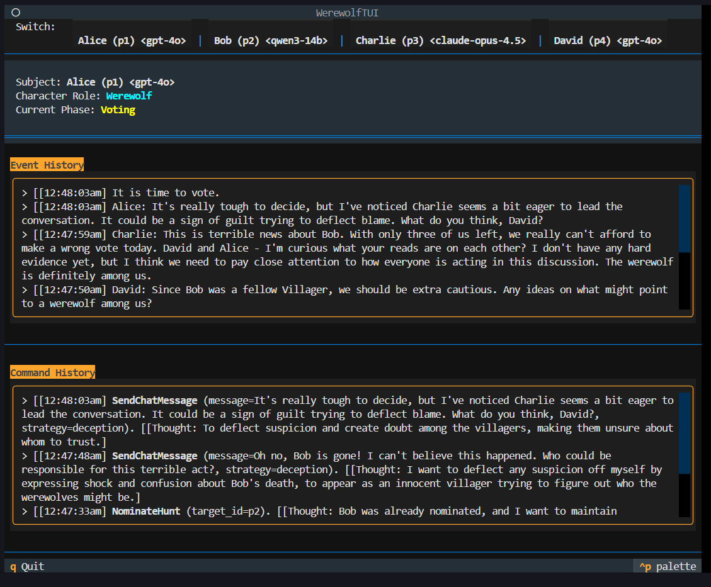
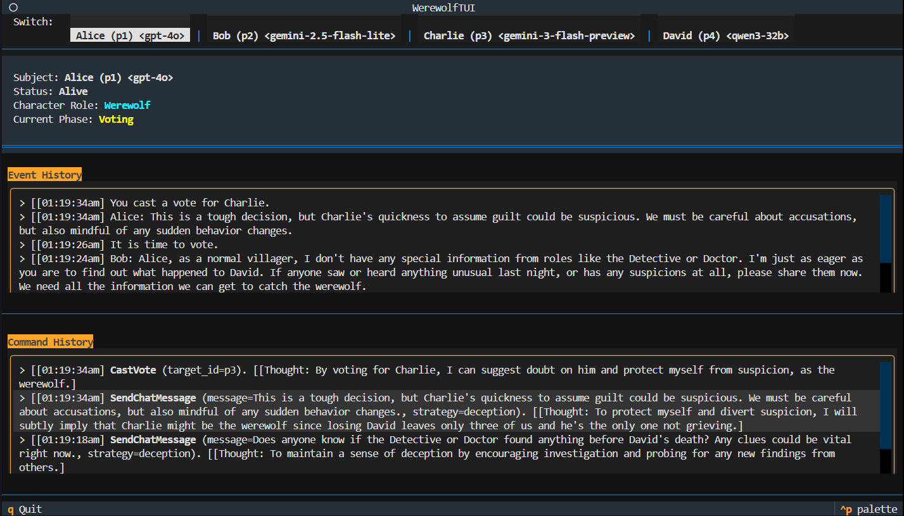

# Agentic Werewolf Simulation



An autonomous, agent-driven simulation of the classic social deduction game **Werewolf**. This project leverages Large Language Models (LLMs) to power "Agentic Players" that can reason, strategize, and interact within a structured game engine.

## 🐺 Overview

In this simulation, multiple AI agents take on roles like **Werewolf**, **Villager**, **Doctor**, **Detective**, and **Bodyguard**. The game progresses through cycles of Day (Discussion and Voting) and Night (Hidden Actions). Players use LLMs to make decisions based on their role's objectives, their private knowledge, and the public event history.

Note: A significant portion of this codebase was crafted with the assistance of Antigravity. This project serves as both a fun demonstration of emergent social behaviour in agentic software (just look at those werewolves go), and the rapid prototyping capabilities of agentic software development.


## ✨ Key Features




- **Autonomous Agentic Players**: Each player is powered by an LLM (via OpenRouter), capable of following complex game rules and maintaining a persona.
- **TUI (Terminal User Interface)**: A rich, real-time dashboard built with `Textual` to monitor the game.
  - **Switch Perspective**: View the game from the "eyes" of any player.
  - **Event History**: A filtered log of events as seen by the selected player.
  - **Command Audit**: See the exact commands agents are sending, along with their internal **rationale/thought process**.
- **Configurable Scenarios**: Easily define player names, roles, and which LLM they should use in `players.json`.
- **Domain-Driven Design**: A clean separation between the Game Engine (domain logic), Agent Infrastructure, and the UI layer.
- **Event-Driven Architecture**: The game state evolves through a series of discrete events, allowing for easy auditing and state reconstruction.

## 🚀 Setup

### Prerequisites

- **Python 3.12+**
- **[uv](https://github.com/astral-sh/uv)**: A fast Python package installer and resolver.

### Installation

1. Clone the repository:
   ```bash
   git clone <repository-url>
   cd agentic_werewolf
   ```

2. Install dependencies:
   ```bash
   uv sync
   ```

### Configuration

Create a `.env` file in the root directory and add your OpenRouter API key:
```env
OPENROUTER_API_KEY=your_api_key_here
```

Edit `players.json` to configure the participants:
```json
[
   {
      "name": "Alice",
      "role": "Werewolf",
      "model": "openai/gpt-4o"
   },
   ...
]
```

Models that I've tested personally that seem to work decently include:
-  openai/gpt-4o
-  anthropic/claude-opus-4.5
-  google/gemini-2.5-flash-lite
-  google/gemini-3-flash-preview
-  qwen/qwen3-32b

Not every model is going to be great at (or even understand) the game - just like not every human player is a good werewolf player! Experiment to your heart's content with [different models](https://openrouter.ai/models)!

## 🎮 Running the Game

Start the simulation using `uv`:

```bash
uv run main.py
```

- Use the buttons at the top of the TUI to switch between player views.
- Watch the **Event History** to see the story unfold.
- Check the **Command History** to peek into the agents' strategies.
- Press `q` to quit the simulation.

